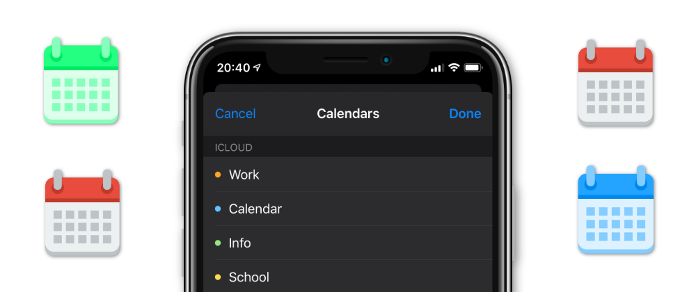

# EKCalendarChooser Example

#### Post available on my [blog](https://nemecek.be/blog/16/how-to-use-ekcalendarchooser-in-swift-to-let-user-select-calendar-in-ios)

Need this in SwiftUI? Check out this [post](https://nemecek.be/blog/39/how-to-use-ekcalendarchooser-with-swiftui). And for more on EventKit you can check out my [series](https://nemecek.be/blog/series/eventkit).

You can also check `EKEventEditViewController` [example](https://github.com/nemecek-filip/EKEventEditViewController.Example). :-)